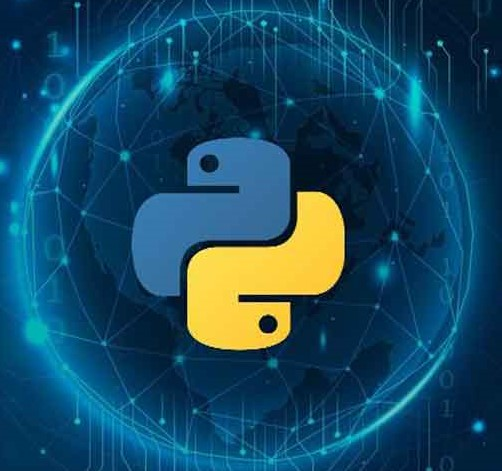
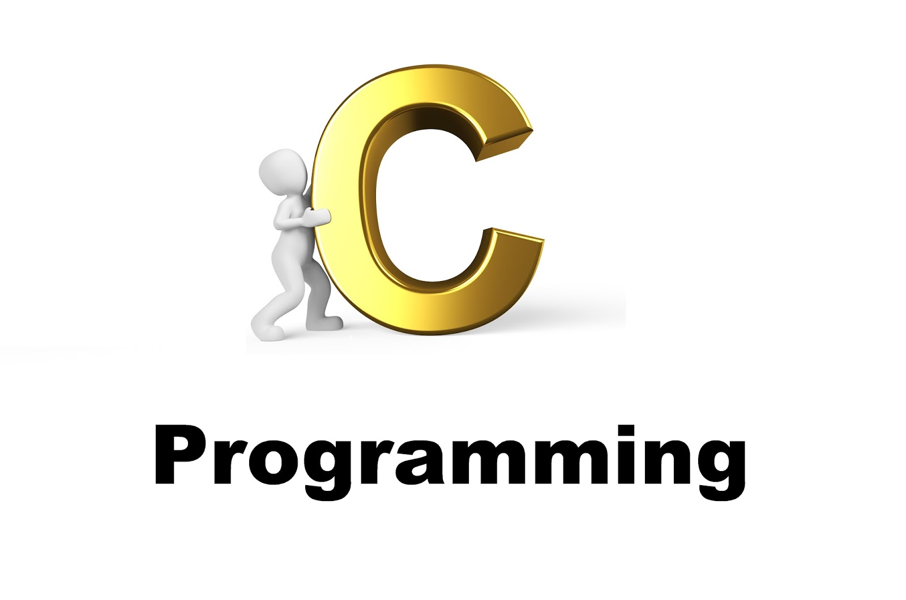
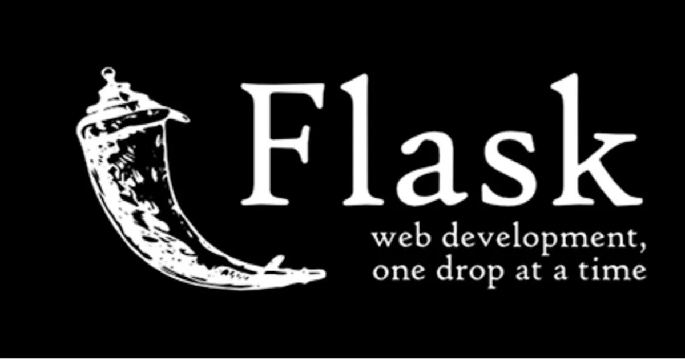
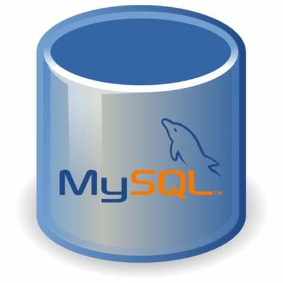
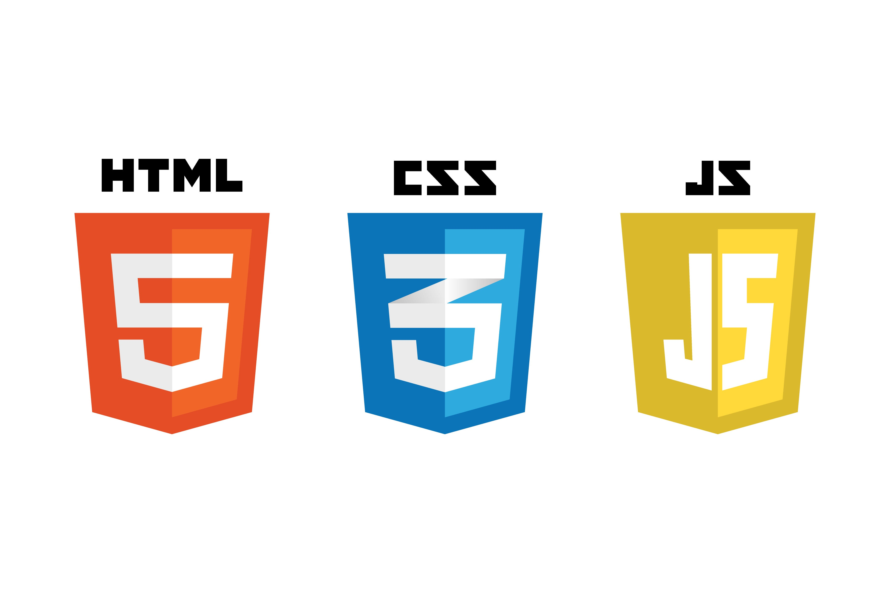
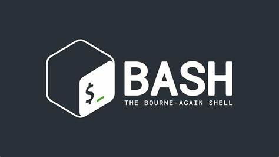

## 
 Hi there, 👋  I am <i>EnGentech</i> (Iberedem Inyang) 

### 🌟 Aspiring Full-Stack Developer Eager to Kickstart My Journey
Are you seeking a passionate and dedicated backend web developer ready to embark on an exciting journey in the world of web development? Look no further!

🚀 Why Choose Me?
📚 Fresh Knowledge: I've recently graduated with a strong foundation in web development, specializing in backend technologies. My educational background equips me with the latest industry knowledge and a hunger to apply it in real-world projects.

💡 Quick Learner: I thrive on learning and adapting. I'm eager to take on challenges, absorb new concepts, and apply them to your projects effectively.

🛠️ Hands-On Approach: While I may not have extensive professional experience yet, I'm committed to hands-on development, crafting code, and problem-solving to deliver the best results for your web applications.

🏆 Passion & Potential:
🌟 I'm eager to dive into challenging backend development tasks and contribute to your projects with enthusiasm.
🌟 I'm dedicated to building clean and efficient code, ensuring your applications run smoothly.
🌟 I'm excited to collaborate with experienced professionals and learn from their expertise.
🔗 Let's Connect!

I'm at the beginning of my web development journey and excited to grow alongside your projects. Let's discuss how I can be an asset to your team.
🌐 Portfolio: http://34.207.58.138/ (# server currently down)

🚀 Ready to take your web projects to the next level with an enthusiastic backend developer? Reach out today, and let's start creating amazing digital experiences together!

  

  

    💻 <b> Technologies I'm Proficient In [Frontend & Backend]:<b>

  

  

    &nbsp;&nbsp;&nbsp;&nbsp;
    &nbsp;&nbsp;&nbsp;&nbsp;
    &nbsp;&nbsp;&nbsp;&nbsp;
    &nbsp;&nbsp;&nbsp;&nbsp;
    &nbsp;&nbsp;&nbsp;&nbsp;
    &nbsp;&nbsp;&nbsp;&nbsp;
    &nbsp;&nbsp;&nbsp;&nbsp;
    &nbsp;&nbsp;&nbsp;&nbsp;
  

  

  

## Contact me

  

  

  

  

  

_Do you prefer <i>call</i>_ 🤔 
<b>Chat or Call: +234-8039-6788-42</b>   

  
 
  
 ### 
 I am open to be trainied and to train   I am open to colaborate with other software engineers around the globe hence to contribute my quota 

<!--
**EnGentech/EnGentech** is a ✨ _special_ ✨ repository because its `README.md` (this file) appears on your GitHub profile.

Here are some ideas to get you started:

- 🔭 I’m currently working on ...
- 🌱 I’m currently learning ...
- 👯 I’m looking to collaborate on ...
- 🤔 I’m looking for help with ...
- 💬 Ask me about ...
- 📫 How to reach me: ...
- 😄 Pronouns: ...
- ⚡ Fun fact: ...
-->
